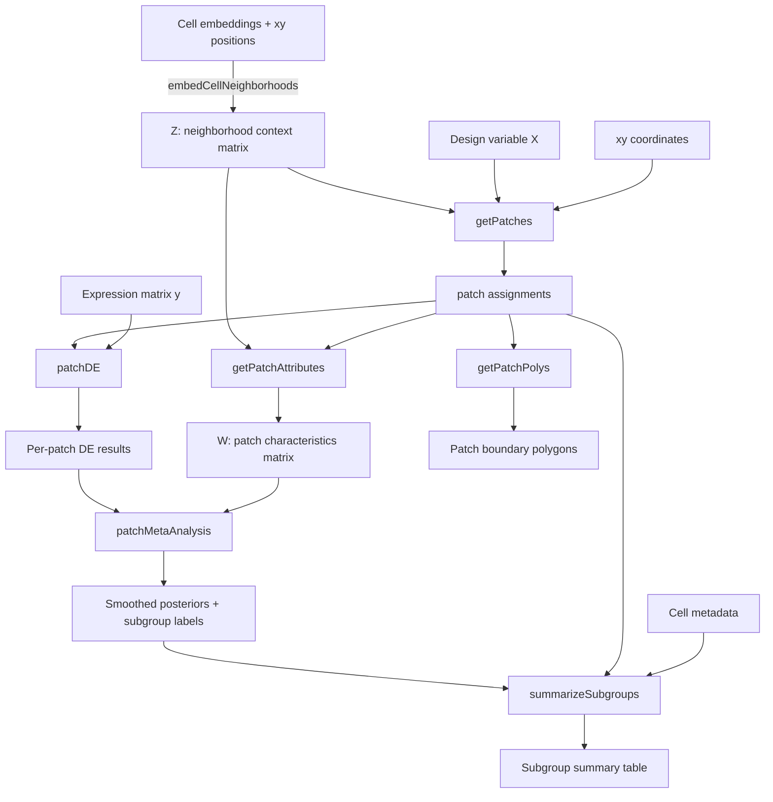

# SpaceMosaic

Spatially-resolved differential expression via elliptical patch partitions.

## Intuition

Standard differential expression (DE) in spatial transcriptomics treats a whole tissue as one unit, ignoring two realities: gene expression is spatially autocorrelated, and biological effects are spatially heterogeneous. A drug response seen in one tissue region may be absent — or reversed — in another.

**SpaceMosaic** splits a tissue into dozens of small spatial patches, runs DE independently in each, then recovers statistical power through Bayesian meta-analysis over biologically similar patches. The result: a map of *where* each DE effect occurs, which patches form coherent subgroups, and what characterizes those subgroups.

## Workflow



## Function overview

| Step | Function | Purpose |
|------|----------|---------|
| 1 | `embedCellNeighborhoods()` | Average cell embeddings over spatial neighbors at multiple scales to get per-cell context vectors Z |
| 2 | `getPatches()` | Iteratively partition cells into contiguous elliptical patches that maximize within-patch variance of X while preserving Z-homogeneity |
| 3 | `patchDE()` | Run fast OLS-based DE simultaneously for all genes within each patch |
| 4 | `getPatchAttributes()` | Summarize Z across cells in each patch to get a patch-level characteristics matrix W |
| 5 | `patchMetaAnalysis()` | For each patch, find K nearest neighbors in W-space, compute a Bayesian posterior update, and detect spatial subgroups of significant patches |
| 6 | `summarizeSubgroups()` | For each gene × subgroup, report effect sizes and enrichment of user-provided metadata variables |
| — | `getPatchPolys()` | Get convex hull polygons for patch visualization |

## Installation

```r
# Install from local source
install.packages("path/to/SpaceMosaic", repos = NULL, type = "source")

# Or with devtools
devtools::install_local("path/to/SpaceMosaic")
```

## Quick start

```r
library(SpaceMosaic)

# Load example data
mini <- readRDS(system.file("extdata", "miniCRC.RDS", package = "SpaceMosaic"))
xy <- mini$xy[mini$clust == "epi", ]
X  <- mini$X[mini$clust == "epi"]
pcs <- mini$pcs[mini$clust == "epi", ]

# 1. Build neighborhood embeddings
Z <- embedCellNeighborhoods(mat = pcs, xy = xy, ks = c(10, 50))

# 2. Define patches
patches <- getPatches(xy = xy, X = X, Z = Z, npatches = 200, n_iters = 15)

# 3. Run DE per patch
y  <- mini$counts[mini$clust == "epi", ]
de <- patchDE(y, data.frame(X = X), patches)

# 4. Meta-analysis
W    <- getPatchAttributes(Z, patches)
meta <- patchMetaAnalysis(de, W, k = 15)

# 5. Summarize subgroups
cellmeta <- data.frame(celltype = mini$clust[mini$clust == "epi"])
summary  <- summarizeSubgroups(meta, patches, cellmeta)
```

## Dependencies

- **cli** — progress bars
- **data.table**, **spatstat.geom** — fast nearest neighbor computation
- **deldir** — Delaunay triangulation for contiguity graphs
- **FNN** — k-nearest neighbors in patch attribute space
- **igraph** — connected component analysis for contiguity enforcement and subgroup detection
- **Matrix** — sparse matrix operations throughout
